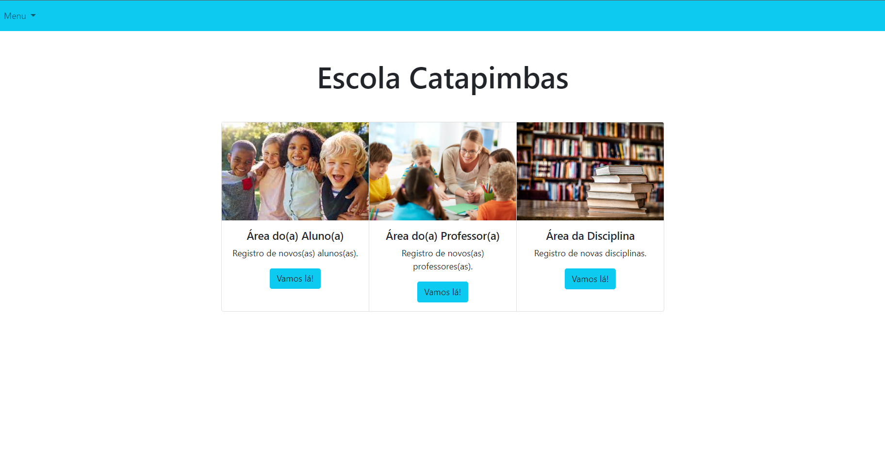
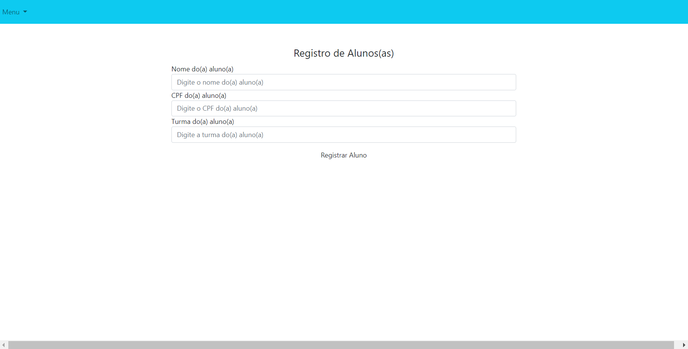
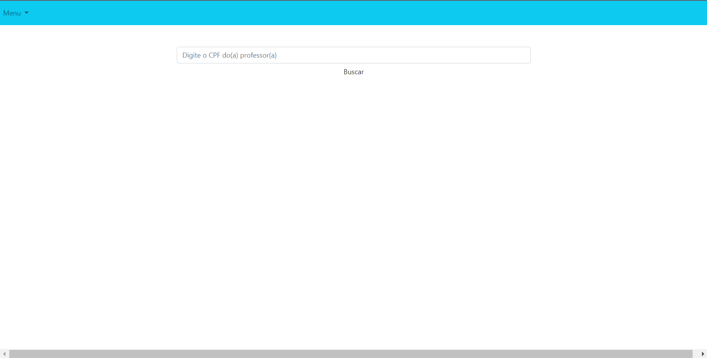

<h1>School Website</h1>

This project is a website for school, where it is possible to control enrollment, register new students and other items.

  

## Built with
[//]: # (Add the features of your project here:)
-  CSS3
-  Java
-  Java

<h1>License</h1>

This project is licensed under the MIT License - see the [LICENSE](https://opensource.org/licenses/MIT) page for details.
